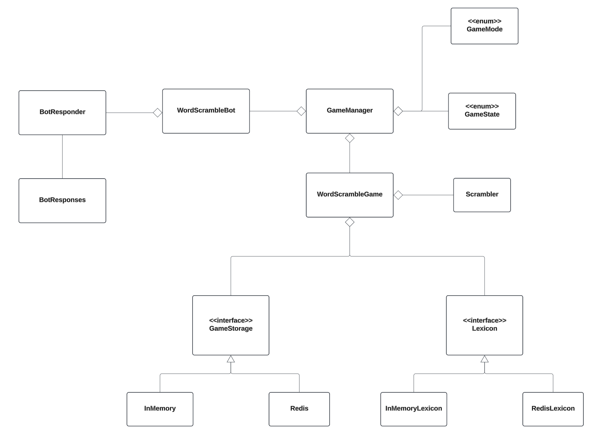

## Project Overview
The project is a Discord Bot that plays Word Scramble. Word Scramble is a game in which a player is given a scrambled word and tries to guess the unscrambled version of the word correctly. The Discord Bot implements a multiplayer racing game, where each player tries to guess what the scrambled word is first in order to be awarded a point. After a word is unscrambled correctly, the next scrambled word in the selected game category will appear. There are two game modes that players can select to play: endless mode and best of # mode. After the game has ended, the results of the game will be shown with information on who won the game along with the end scores for each player that participated in the game.

### Game Commands
Provided below are the valid commands users can enter into the Discord Chat to interact with the Bot:
* **!categories -** get a list of categories.
* **!start <category> <mode> -** start a new game with specified category and selected game mode.
* **!start random <mode> -** start a new game with a random category and selected game mode.
* **!modes -** shows the different game modes.
* **!join -** executed by any user who wants to join the game.
* **!go -** used to start gameplay.
* **!status -** get the status of the game.
* **!quit -** ends the game and shows results.
* **!rules -** explains the rules of the game.
* **!help -** list the commands and basic explanation.

### System Diagram



## Setup Instructions
### Terminal
* Install [Homebrew](https://brew.sh)
  ```
  /bin/bash -c "$(curl -fsSL https://raw.githubusercontent.com/Homebrew/install/HEAD/install.sh)"
  ```

* Install [Git](https://git-scm.com/downloads/mac)
  ```
  brew install git
  ```

* Install [OpenJDK](https://formulae.brew.sh/formula/openjdk)
  ```
  brew install openjdk
  ```
  ```
  sudo ln -sfn /opt/homebrew/opt/openjdk/libexec/openjdk.jdk /Library/Java/JavaVirtualMachines/openjdk.jdk
  ```

* Install [Maven](https://maven.apache.org/install.html)
  ```
  brew install maven
  ```

* Install [Redis](https://redis.io/docs/latest/operate/oss_and_stack/install/archive/install-redis/)
  ```
  brew install redis
  ```

### Discord
1. Create an Account (https://discord.com)

2. Create an App (https://discord.com/developers/applications)
    * Create a "New Application".
    * Click on the "Bot" section in the menu on the left.
    * Find the section named "Privileged Gateway Intents".
    * Click the toggle button next to "Message Content Intent".
    * Click "Save Changes" that appears at the bottom of the webpage.

3. Obtain the App Token
    * Click on the "Bot" section in the menu on the left.
    * Find the section named "Token".
    * Click "Reset Token" and copy token for later use.

4. Authorize the App
    * Click on the "OAuth2" section in the menu on the left.
    * In the "Scopes" section, select the checkbox for "bot".
    * In "Bot Permissions" under "Text Permissions", click the checkbox for "Send Messages".
    * At the bottom under "Generated URL" click "Copy".
    * Paste the URL into a new browser tab.
    * When the page loads, under "Add to Server" select the desired server for app.
    * Authorize the bot, and then close this tab.
  
